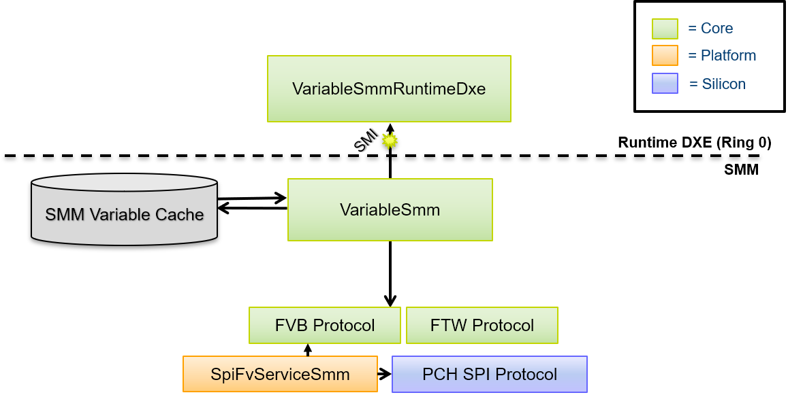
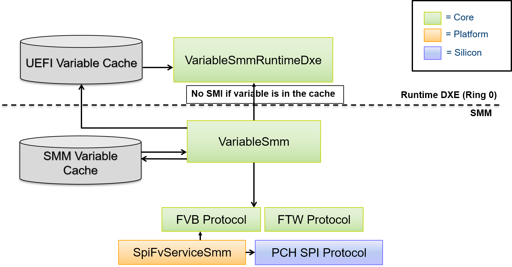

The UEFI Variable Runtime Cache feature was introduced to reduce the total number of SMIs triggered and therefore total
system time in SMM when SMM UEFI variables are enabled.

* Pros:
  * Improves system boot time
  * Improves system stability
  * Reduces SMI impact on the operating system (of particular importance in real-time operating systems)
* Cons:
  * Increases in runtime system memory

    > Note: The memory increase is relatively minimal where the increase size is equal to the sum of the size of all
            non-volatile UEFI variable stores on the platform. Typically there is just one non-volatile variable store.

The feature is enabled and disabled by the following FeaturePCD in MdeModulePkg:
```
  ## Indicates if the UEFI variable runtime cache should be enabled.
  #  This setting only applies if SMM variables are enabled. When enabled, all variable
  #  data for Runtime Service GetVariable () and GetNextVariableName () calls is retrieved
  #  from a runtime data buffer referred to as the "runtime cache". An SMI is not triggered
  #  at all for these requests. Variables writes still trigger an SMI. This can greatly
  #  reduce overall system SMM usage as most boots tend to issue far more variable reads
  #  than writes.<BR><BR>
  #   TRUE  - The UEFI variable runtime cache is enabled.<BR>
  #   FALSE - The UEFI variable runtime cache is disabled.<BR>
  # @Prompt Enable the UEFI variable runtime cache.
  gEfiMdeModulePkgTokenSpaceGuid.PcdEnableVariableRuntimeCache|TRUE|BOOLEAN|0x00010039
```
The default PCD value is TRUE meaning the feature is enabled by default. The feature can be disabled by simply setting
the PCD value to "FALSE" in a platform DSC file.

# Problem Statement
The UEFI Runtime Service GetVariable () is called very often throughout the boot including OS runtime. Each Runtime
Service GetVariable () call triggers an SMI which negatively impacts system performance.

## Issues with SMM
SMM is typically undesirable for at least the following reasons:
1. Core rendezvous: When the system enters SMM, all CPU activity is blocked at other privilege levels.
2. Interrupt latency: Real-Time Operating Systems (RTOS) have stringent requirements to service system interrupts
   which is severely impacted by frequent SMIs at OS runtime.

## Platforms Have Little Choice
Today's computer systems must comply with a myriad of industry specifications that often leverage the UEFI variable
mechanism as defined in the UEFI specification as a form of OS independent non-volatile storage. In some cases, system
software interacts with UEFI variables outside the control of user software impacted. The following examples are
intended to help illustrate this statement.
1. Firmware interfaces such as UEFI capsule update requires UEFI variables.
2. Industry specifications define variables such as BootOrder, OsIndications, and UEFI Secure Boot related variables
   such as pk, kek, db, dbx, etc. creating an interface between the platform firmware and operating system.
3. Operating systems such as Microsoft Windows 10 sometimes issue periodic UEFI variable reads independent of user
   software.
4. Operating systems such as Microsoft Windows 10 use UEFI variables to manage checkpoints of disk dumps during bug
   check scenarios.

In any case, reducing the overall system impact due to UEFI variables benefits all software on the system.

## Sample GetVariable () Impact
The following data is intended to show why this feature can be useful. Assume an RTOS has a maximum latency allowance
of 10us. The following measurements were taken from an Intel&reg; Apollo Lake Reference and Validation Platform and show
this threshold is not achievable with any SMM involvement.

Observation                                                  | Duration
-------------------------------------------------------------|------------------
Pure SMI entry latency (RSM w/ no rendezvous)                | 40us
Dummy SMI handler (port 0xB2 I/O port w/ 0x88)               | 180us
RT->GetVariable () (called for an existing UEFI variable)    | 220us
RT->GetVariable () (called for a non-existing UEFI variable) | 272us

> Note: This data does not reflect the performance of the product in any particular configuration and is only provided
for illustrative purposes of the relative duration for the given scenarios.

## A Phased Approach
Ideally, SMM could be eliminated entirely. However, SMM continues to serve a useful purposes in that it provides a
ubiquitous isolated execution environment to authenticate UEFI variable requests. Further, SMM provides a trusted
software environment to manage UEFI variable transactions to non-volatile storage (e.g. SPI flash or eMMC/UFS RPMB) at
OS runtime when hardware enforcement of write access is restricted to SMM.

### Priority: Reduce SMM Usage for Getting UEFI Variables
The rationale for preserving SMM applies to SetVariable () but not GetVariable () or GetNextVariableName (). This
realization led to the UEFI Variable Runtime cache feature. Fortunately, getting variables as opposed to setting
variables is much more common.

On an Intel&reg; Atom Reference and Validation Platform (RVP), it was found that after a first boot (also referred to
as a "manufacturing boot" in which many UEFI variables are written to initialize the UEFI variable store), the number
of GetVariable () calls exceeded 150 while the number of SetVariable () calls was less than 10. GetVariableName () was
also invoked multiple times which is often called many times successively to iterate over the current set of variables
each time invoking an SMI.

On the same Intel&reg; Apollo Lake system used in the earlier data table, it was found that with the UEFI Variable
Runtime Cache feature enabled, the total GetVariable () time for an existing UEFI variable decreased to 5us from 220us.

Therefore, analysis showed that eliminating SMIs on Runtime Service GetVariable () and GetNextVariableName () calls is
possible and can lead to the greatest potential improvement in terms of SMM reduction across the UEFI variable services.

# Summary of Changes
The UEFI Variable Runtime Cache feature reduces overall system SMM usage when using VariableSmmRuntimeDxe with
VariableSmm for SMM UEFI variables. It does so by eliminating SMM usage for the Runtime Service GetVariable () and
GetNextVariableName () functions.

## Major Changes
 1. Two UEFI variable caches will be maintained.
    * "Runtime Cache" - Maintained in VariableSmmRuntimeDxe. Used to serve
      runtime service GetVariable () and GetNextVariableName () callers.
    * "SMM Cache" - Maintained in VariableSmm to service SMM GetVariable ()
      and GetNextVariableName () callers.

      > Note: A cache in SMRAM is retained so SMM modules do not operate on data
        outside SMRAM.
 2. A new UEFI variable read and write flow will be used as described below.

At any given time, the two caches should be coherent. On a variable write, the runtime cache is only updated after
validation in SMM and, in the case of a non-volatile UEFI variable, the variable must also be successfully written
to non-volatile storage.

# Design Details
This section covers various design related details to help provide context and background for this feature.

## UEFI Variable Cache Background
A UEFI variable host memory cache existed in the EDK II UEFI variable driver prior to this feature. When SMM UEFI
variables are enabled, the cache is maintained in SMRAM by VariableSmm. Hence the previous behavior for a runtime
UEFI variable call to trigger an SMI, the SMI handler to check for a cache hit, and then consult non-volatile storage
on a cache miss.

In general, the UEFI variable cache before and after this feature serves as a write-through cache of all variable data
in the form of a host memory variable store. Volatile UEFI variables are entirely maintained in a host memory variable
store although in a different buffer than the non-volatile UEFI variable cache.

### Previous UEFI Variable Cache


### UEFI Variable Cache with Runtime Cache


### High-Level GetVariable () Flow with the Runtime Cache
 flow with the runtime cache")

### High-Level SetVariable () Flow with the Runtime Cache
 flow with the runtime cache")

## Runtime & SMM Cache Coherency
The non-volatile cache should always accurately reflect non-volatile storage contents (done today) and the "SMM cache"
and "Runtime cache" should always be coherent on access. The runtime cache is only updated by VariableSmm.

Updating both caches from within a SMM SetVariable () operation is fairly straightforward but a race condition can
occur if an SMI occurs during the execution of runtime code reading from the runtime cache. To handle this case,
a runtime cache read lock is introduced that explicitly moves pending updates from SMM to the runtime cache if an SMM
update occurs while the runtime cache is locked. Note that it is not expected a Runtime services call will interrupt
SMM processing since all CPU cores rendezvous in SMM.

### Runtime DXE Read Flow
 1. Acquire RuntimeCacheReadLock
 2. If RuntimeCachePendingUpdate flag (rare) is set then:
    * Trigger FlushRuntimeCachePendingUpdate SMI
    * Verify RuntimeCachePendingUpdate flag is cleared
 3. Perform read from RuntimeCache
 4. Release RuntimeCacheReadLock

### FlushRuntimeCachePendingUpdate SMI Flow
 1. If RuntimeCachePendingUpdate flag is not set:
    * Return
 2. Copy the data at RuntimeCachePendingOffset of RuntimeCachePendingLength to
    RuntimeCache
 3. Clear the RuntimeCachePendingUpdate flag

### SMM Write Flow
 1. Perform variable authentication and the non-volatile write. If either fail,
    return an error to the caller.
 2. If RuntimeCacheReadLock is set then:
    * Set RuntimeCachePendingUpdate flag
    * Update RuntimeCachePendingOffset and RuntimeCachePendingLength to
      cover the a superset of the pending chunk (for simplicity, the
      entire variable store is currently synchronized).
 3. Else:
    * Update RuntimeCache
 4. Update SmmCache

    > Note: RT read cannot occur during SMI processing since all cores are
      locked in SMM.

## Security Concerns
A common concern raised with this feature is the potential security threat presented by serving runtime services
callers from a ring 0 memory buffer of EfiRuntimeServicesData type. The conclusion of analyzing this during the proposal
phase was that this change does not fundamentally alter the attack surface. The UEFI variable Runtime Services are
invoked from ring 0 and the data already travels through ring 0 buffers (such as the SMM communicate buffer) to reach
the caller. Even today if ring 0 is assumed to be malicious, the malicious code could keep one AP in a loop to monitor
the communication data, when the BSP gets an (authenticated) variable. When the communication buffer is updated and the
status is set to EFI_SUCCESS, the AP could modify the communication buffer contents such that tampered data is returned
to the BSP caller. Or an interrupt handler on the BSP could alter the communication buffer contents before the data is
returned to the caller. In summary, this feature was not found to introduce any attack not possible today.
